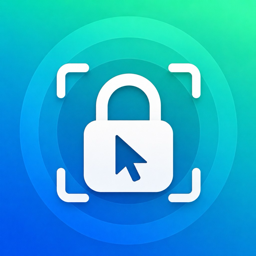

<p align="center">
  
</p>

<h1 align="center">FocusLock</h1>

<p align="center">
  A macOS menu bar app that automatically locks your mouse/keyboard to the screen you're gaming on, via <a href="https://deskflow.org">Deskflow</a>.
</p>

---

## What it does

If you use [Deskflow](https://deskflow.org) (a Synergy-like KVM) to share one keyboard/mouse across multiple Macs, it's easy to accidentally nudge your mouse onto another screen mid-game. FocusLock fixes that:

- Watches one or more apps/games you configure (default: League of Legends).
- The moment a watched app becomes active, it sends a **LOCK** hotkey; the moment none of them are active anymore, it sends an **UNLOCK** hotkey.
- Deskflow is configured to bind those two hotkeys to `Switch to screen` + `Lock cursor to screen (on/off)`, so your input stays pinned to the machine you're playing on.
- Add/remove watched apps straight from the menu bar — no rebuilding, no re-granting permissions.
- One click auto-configures the Deskflow hotkeys for you (no manual keybinding in Deskflow's GUI required).

This repo contains the full Swift source (`AppSource/main.swift`), a build script, and the setup guide below.

## Requirements

- macOS 13 or later
- [Deskflow](https://deskflow.org) installed and already sharing your screens

## Install

1. Download `FocusLock.app.zip` from [Releases](https://github.com/hieutranhamcode/focuslock/releases/latest) and unzip it (or clone this repo, which already includes `FocusLock.app`).
2. Drag `FocusLock.app` into `/Applications`.
3. Open it the first time via **right-click → Open** (the app is ad-hoc signed, not notarized, so macOS will warn about an "unidentified developer" once).
   - If macOS quarantines the file after downloading/AirDrop (menu bar icon doesn't appear, or the app is blocked outright), run `xattr -cr /Applications/FocusLock.app` and reopen.
4. A padlock icon appears in the menu bar (open = unlocked, closed = locked). Click it to open the menu.
5. Grant permissions in **System Settings → Privacy & Security**:
   - **Accessibility** → add `FocusLock` ✅
   - **Input Monitoring** → add `FocusLock` ✅
   - (You may need to quit and reopen the app after granting permissions for the first time.)
6. In the menu, enable **"Start at Login"** so it launches automatically (no manual LaunchAgent needed).
7. The default watch list is League of Legends. To watch something else, use **"Add App from Applications..."** or **"Add Running App"** in the menu — takes effect immediately, no rebuild required.

### Building from source

```bash
git clone https://github.com/hieutranhamcode/focuslock.git
cd focuslock
./build_app.sh
```

This compiles `AppSource/main.swift` into a universal binary (Apple Silicon + Intel) and packages `FocusLock.app`, embedding the icon from `AppSource/Assets/AppIcon.icns`.

## Configuring Deskflow's hotkeys

FocusLock needs Deskflow's F14/F15 hotkeys wired up to `Switch to screen` + `Lock cursor to screen`. There are two ways to do this — pick one.

### Option A: Auto-configure (recommended)

Once FocusLock is installed, open its menu and click **"Auto-Configure Deskflow Hotkeys"**. It will:

1. Quit Deskflow.
2. Edit `~/Library/Deskflow/Deskflow.conf` directly, creating/updating two hotkeys:
   - **F14 (LOCK):** `Switch to screen` → this machine → `Lock cursor to screen: On`
   - **F15 (UNLOCK):** `Lock cursor to screen: Off`
3. Relaunch Deskflow.

The target screen name is read automatically from this machine's own `computerName` in `Deskflow.conf` — whichever Mac you install FocusLock on and run this action on is the screen that gets locked to. A backup of the original file is saved as `Deskflow.conf.focuslock-backup`.

### Option B: Manual setup in Deskflow's GUI

Open Deskflow → **Settings → Hotkeys** and create two hotkeys:

**Hotkey 1 — F14**
- Action 1: `Switch to screen` → this machine's screen name (see Deskflow → Server → Screens)
- Action 2: `Lock cursor to screen` → `On`

**Hotkey 2 — F15**
- Action 1: `Lock cursor to screen` → `Off`

> Press the real F14/F15 keys on that machine's keyboard so Deskflow records the correct key code. F14/F15 are used instead of F1/F2 because macOS reserves F1/F2 for brightness and never lets the keypress reach Deskflow.

**If Deskflow doesn't register the key press** (some compact/wireless keyboards, e.g. NuPhy, send F13+ over a HID path that Deskflow's hotkey recorder doesn't recognize, even though synthetic key events work fine): skip manual recording and edit the config file directly after **fully quitting Deskflow** (GUI + the `deskflow-core` background process — check Activity Monitor):

In `~/Library/Deskflow/Deskflow.conf`, find the two `hotkeys\N\keys\1\key=...` lines for the hotkeys you just created (they exist in the file whether or not the recording worked) and set their value using this table:

| Key  | Qt key code |
|------|-------------|
| F13  | 16777276 |
| F14  | 16777277 |
| F15  | 16777278 |
| F16  | 16777279 |

Example: a LOCK hotkey using F14 → `hotkeys\1\keys\1\key=16777277`; an UNLOCK hotkey using F15 → `hotkeys\2\keys\1\key=16777278`. Save and relaunch Deskflow. This doesn't affect the automation at all — FocusLock sends synthetic key events, so the physical keyboard never needs to recognize the key.

After either option, restart Deskflow fully (kill it via Activity Monitor, not just close the window — Deskflow keeps the old config in memory otherwise) and grant it Accessibility (and Input Monitoring, if prompted) in **System Settings → Privacy & Security**.

## Troubleshooting

- **Deskflow doesn't react when a watched app opens/closes:** almost always missing Accessibility/Input Monitoring permission for FocusLock, or Deskflow's F14/F15 hotkey doesn't match the real key code (see the Qt key code table above).
- **View the watcher log:** menu → **"View Log..."**, or:
  ```bash
  tail -f ~/Library/Application\ Support/FocusLock/watcher.log
  ```
- **Permissions disappear after rebuilding the app:** macOS revokes TCC grants whenever a binary's code signature changes (true even for ad-hoc signed apps). After running `./build_app.sh` again, remove and re-add FocusLock in Accessibility/Input Monitoring rather than just toggling it off/on.
